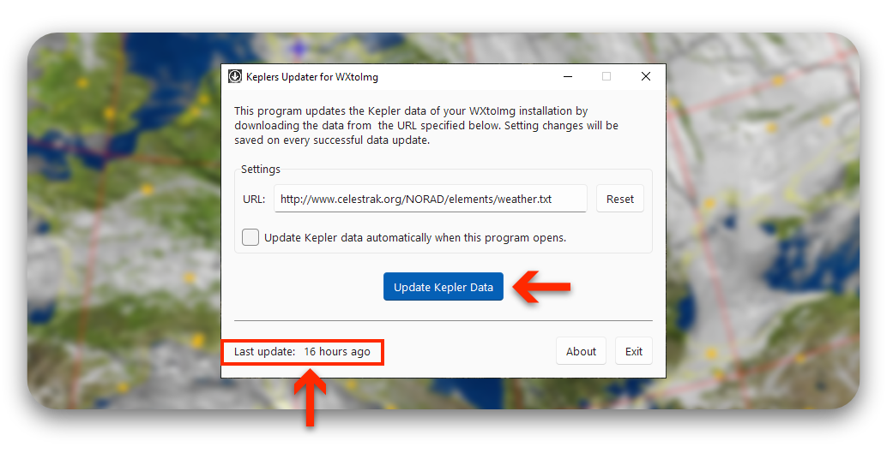
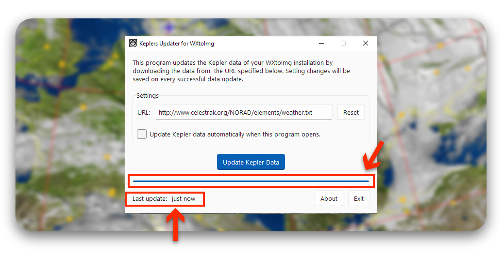
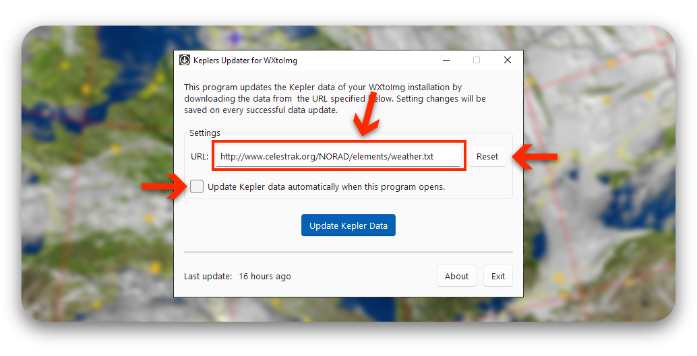
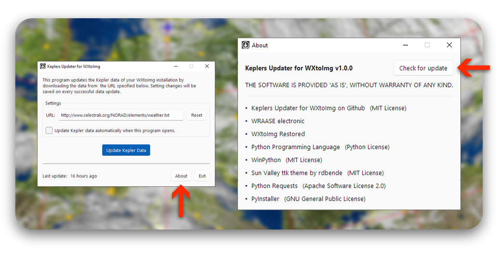

# Keplers Updater for WXtoImg

A tool to easily update Kepler Data for WXtoImg with a graphical user interface on Windows.

## Background

WXtoImg is a powerful software for automatically decoding WEFAX and APT weather satellite signals and is still the best
software for this job and therefore widely used in the community. Unfortunately, WXtoImg is not Open Source and since
the software was completely abandoned by its developers in 2018, going so far that even its website and all released
binaries vanished, some members of the community have taken over and collected most information from web archives and
released them on a new unofficial website [WXtoImg Restored](https://wxtoimgrestored.xyz/).

### Kepler Data

To automatically receive weather satellite images, mainly from the satellites NOAA 15, 18, and 19, which have not been
decommissioned yet, WXtoImg requires orbital data of these satellites. These must be supplied to the software in the
[TLE](https://en.wikipedia.org/wiki/Two-line_element_set) format as a simple text file called 'weather.txt'.

Fortunately, WXtoImg has a built-in function to automatically download the latest Kepler data
from [www.celestrak.com](https://celestrak.org). But in July 2022, [Celestrak](https://celestrak.org) changed their
top-level domain from .com to .org, and thus, breaking the built-in update functions because WXtoImg fails to handle the
HTTP Code 301 redirect that was put in place.

Kepler Update for WXtoImg is a new, easy to use tool to replace WXtoImgs's built-in function to update the Kepler data.

## Installation

### Download

The easiest way to get Keplers Updater for WXtoImg is to download the latest release from the [Releases](releases)
section on the right or just click the link below:

[Keplers Updater for WXtoImg v.1.0.0 (Windows 7+)](releases)

The application doesn't need to be installed. Just double-click **Keplers-Updater.exe** to launch it.

### From source

The application is written in Python 3.8. The necessary Python packages and binaries for Windows are included in the
repository. To start the app, from within the root directory of the repository, run:

> .\start.bat

#### Bundle with pyinstaller

Using [pyinstaller](https://github.com/pyinstaller/pyinstaller), the application can be bundled into a shareable folder
or into a single executable. The UI launches more quickly when bundled into a folder.

To bundle into a single executable, run:
> .\bundle-to-exe.bat

To bundle into a folder, run:
> .\bundle-to-dir.bat

The bundled folder or executable can be found in .\dist\

#### Other Python environment

To run the app from within your own Python environment, make sure you have the following required packages installed:
`tkinter, sv_ttk, requests, datetime, webbrowser`

## Usage

Just click on the blue **Update Kepler Data** button to download the latest Kepler data. Before you do, you can check
the time of last update in the bottom left corner. The progressbar below the button should start to fill.

If the update was successful, you will see that the time of last update will change to **just now** and the blue
progress bar will remain filled. If the update fails, an error message should pop up instead.

### Settings

Enable the checkbox on the left to automatically update the Kepler data every time Kepler Updater for WXtoImg time is
opened, so you don't have to press the button.

**Note**: Changes to the settings will be saved **after** a successful update of the Kepler data.

You shouldn't need to, but just in case Celestrak changes their URLs again, it is possible to change the URL from where
the Kepler data is downloaded from. Click the **Reset** button to switch it back to the default URL.

### App-Update

You can check for new releases of the app by first opening the **About** and then pressing on **Check for updates** in
the top right corner of the new window. If a new release is available, this will guide you to the [Releases](releases)
section here on GitHub.

## Other solutions to update Kepler Data

### wxtoproxy

[wxtoproxy](https://github.com/provector/wxtoproxy/) launches WXtoImg with a simple proxy server to handle the redirect.
Using wxtoproxy, the built-in functions to update Keplers are restored.

### Using Powershell and a scheduled task

A step-by-step instruction on how to use a scheduled task that calls a simple powershell script to download the newest
Kepler data can be found [here](https://usradioguy.com/wxtoimg-kepler-fix/). This might be too cumbersome for some
users, who do not feel comfortable using the command line.

## License

[MIT License](LICENSE) © Stefan Wraase
